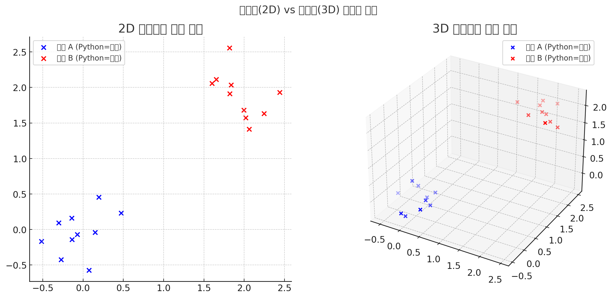

# RAG 기반 LLM 구현 순서

<br>

## RAG가 뭔가요?
- RAG = Retrieval-Augmented Generation
- 직역하면 검색 보강 생성
- 말 그대로 “검색(Retrieval)” 과 “생성(Generation)”을 결합한 구조

기본 아이디어는 LLM(ChatGPT, Gemini 등...) 혼자 모든 걸 외우고 답하는 게 아니라, 필요한 정보를 외부에서 검색해서 가져오고, 그걸 바탕으로 답변을 생성한다는 원리.

<br>

## 기존 AI들도 이미 똑똑한데 꼭 필요한가요..?

### 🔹 LLM의 한계
- ChatGPT, Gemini 같은 LLM도 강력하지만, **훈련 당시 데이터까지만 학습**했기 때문에 최신 정보 반영에 한계가 있음.  
- 결정적으로, 내부망에서만 공유되던 사내 서비스나 제품 관련 문서, 회사 규정, 시스템 데이터 등은 전혀 알 수 없음.
- 모든 지식을 모델이 “외워서” 답하게 하려면 **막대한 재학습 비용과 메모리**가 필요함.  

### 🔹 프라이버시 & 보안
- 기업 내부 문서를 ChatGPT 서버에 직접 업로드하기 어려움 (보안 규정, 개인정보, 저작권 문제).
- RAG를 쓰면 내부 벡터DB에만 문서 저장 → LLM에는 질문+관련 context만 전달 → 데이터 유출 위험 최소화. (API 기반이 아닌 오픈소스 모델을 개발하면 데이터 유출 Zero)

### 🔹 비용 효율성
- 상용 LLM에 “수천 페이지 자료를 그대로 프롬프트에 넣기” → 토큰 비용 폭발 💸
- RAG는 질문할 때마다 관련된 chunk 몇 개만 추출해서 넣음 → 토큰 사용량 절감 → 훨씬 경제적.  

### 🔹 최신성 유지
- ChatGPT가 최신 정보로 fine-tune 됐다고 해도, 내 서비스/내 제품의 문서는 수시로 업데이트됨.
- 매번 LLM을 새로 학습시킬 수는 없지만, 벡터DB 업데이트만 하면 실시간 최신 반영 가능.

👉 예: “우리 쇼핑몰의 금일 재고 현황” → ChatGPT는 절대 모름.
- But... RAG 기반 검색은 DB 최신 값 가져와 답변 가능.
 

### 🔹 Hallucination 감소

- LLM은 광범위한 지식을 가지고있지만, 실제로는 틀린 사실을 만들어내기도 함.
- RAG는 특정 범위에 대해 커스텀된 자료들 위주로 답변하므로 신뢰도가 매우 높음.

### 정리
- **LLM**: 방대한 텍스트를 학습한 언어 모델 (백과사전 같은 역할)  
- **RAG**: 검색(Retrieval) + 생성(Generation)을 결합한 구조 (오픈북 시험 같은 방식)  
- 최신 문서와 내부 자료까지 검색 후 LLM이 참고해 답변하므로, 일반 AI만 활용하는 것에 비해  
  **더 정확하고, 최신이며, 안전하고, 비용 효율적인 결과**를 얻을 수 있다.  

<br>

## 1. 데이터 로드 (raw data)

``` python
from langchain.document_loaders import TextLoader
loader = TextLoader("example.txt")
documents = loader.load()
print(documents[0].page_content[:500])  # 앞부분만 출력
```

`<출력 예시>`

    Python은 범용 프로그래밍 언어로, 간결한 문법과 강력한 라이브러리를 제공한다.
    웹 개발, 데이터 과학, 인공지능, 자동화 스크립트 등 다양한 분야에서 활용된다.
    특히 인공지능 분야에서는 TensorFlow, PyTorch 같은 프레임워크를 통해 빠른 연구와 개발이 가능하다.
    또한 파이썬은 커뮤니티가 크고, 오픈소스 생태계가 활발하여 문제 해결과 학습에 유리하다.
    이러한 특성 때문에 교육용 언어로도 널리 사용되며, 초보자도 쉽게 접근할 수 있다.
    전 세계적으로 수많은 개발자들이 파이썬을 사용하고 있으며, 다양한 분야의 혁신적인 프로젝트가 파이썬을 기반으로 이루어지고 있다.

<br>

## 2. 데이터 분할 (chunking)

``` python
from langchain.text_splitter import RecursiveCharacterTextSplitter
splitter = RecursiveCharacterTextSplitter(chunk_size=50, chunk_overlap=10)
chunks = splitter.split_documents(documents)
for i, c in enumerate(chunks, start=1):
    print(f"Chunk {i}:", c.page_content)
```

`<출력 예시>`

    Chunk 1: Python은 범용 프로그래밍 언어로, 간결한 문법과
    Chunk 2: 문법과 강력한 라이브러리를 제공한다. 웹 개발, 데이터 과학,
    Chunk 3: 데이터 과학, 인공지능, 자동화 스크립트 등 다양한 분야에서 활용된다.
    Chunk 4: 특히 인공지능 분야에서는 TensorFlow, PyTorch 같은 프레임워크를
    Chunk 5: 프레임워크를 통해 빠른 연구와 개발이 가능하다. 또한 파이썬은 커뮤니티가
    Chunk 6: 커뮤니티가 크고, 오픈소스 생태계가 활발하여 문제 해결과 학습에
    Chunk 7: 학습에 유리하다. 이러한 특성 때문에 교육용 언어로도 널리 사용되며,
    Chunk 8: 널리 사용되며, 초보자도 쉽게 접근할 수 있다. 전 세계적으로
    Chunk 9: 전 세계적으로 수많은 개발자들이 파이썬을 사용하고 있으며,
    Chunk 10: 사용하고 있으며, 다양한 분야의 혁신적인 프로젝트가 파이썬을
    Chunk 11: 프로젝트가 파이썬을 기반으로 이루어지고 있다.

<br>

## 3. 임베딩 (Chunk → Vector 변환)

``` python
from langchain.embeddings import OpenAIEmbeddings
embedding_model = OpenAIEmbeddings()

# 각 chunk를 벡터로 변환
vectors = embedding_model.embed_documents([c.page_content for c in chunks])

for i, vec in enumerate(vectors, start=1):
    print(f"Chunk {i} 임베딩:", vec[:10])  # 각 벡터의 앞 10차원만 출력
```
### 왜 고차원 벡터를 사용하는가?



 - 최신 임베딩 모델들은 문장 단위로 임베딩을 생성
 - 단어 하나만 따로 임베딩하는 게 아니라 문장 속에서의 의미를 반영해서 벡터를 만듦
 - 같은 단어라도 “주제·용법·앞뒤 문맥”에 따라 벡터 값이 달라지게 설계

`<출력 예시>`

    Chunk 1 임베딩: [0.0123, -0.9382, 0.4421, 0.1223, -0.5521, 0.3342, -0.8711, 0.0923, 0.2211, ...]
    Chunk 2 임베딩: [-0.1122, 0.8234, -0.4211, 0.3321, 0.5523, -0.2188, 0.7621, -0.1231, 0.4422, ...]
    Chunk 3 임베딩: [0.9112, 0.1121, -0.3321, -0.1288, 0.5521, 0.1182, -0.8821, 0.9921, -0.2123, ...]
    Chunk 4 임베딩: [0.3312, -0.5522, 0.2211, 0.7732, 0.1281, -0.1142, 0.6621, -0.3421, 0.5512, ...]
    Chunk 5 임베딩: [-0.4451, 0.1188, 0.3341, -0.2211, 0.8822, -0.7712, 0.1121, 0.5522, -0.1188, ...]
    Chunk 6 임베딩: [0.1233, -0.3341, 0.1182, -0.4412, 0.2234, 0.9921, -0.1182, 0.5521, 0.7721, ...]
    Chunk 7 임베딩: [0.1181, 0.2233, -0.4452, 0.1128, 0.5521, 0.3381, -0.9921, 0.1182, 0.2231, ...]
    Chunk 8 임베딩: [-0.5521, 0.6621, 0.1121, -0.3342, 0.1181, 0.2233, 0.4451, -0.1188, 0.3321, ...]
    Chunk 9 임베딩: [0.4451, -0.2211, 0.1188, 0.5522, -0.3342, 0.1183, -0.9922, 0.3321, 0.1121, ...]
    Chunk 10 임베딩: [0.1188, -0.5521, 0.6622, 0.1181, 0.2231, -0.4452, 0.1122, 0.9922, -0.2233, ...]
    Chunk 11 임베딩: [-0.2233, 0.1182, -0.4451, 0.6622, 0.1122, 0.5521, -0.3341, 0.1181, 0.2211, ...]

<br>

## 4. 벡터DB에 저장

``` python
from langchain.vectorstores import FAISS
vectorstore = FAISS.from_documents(chunks, embedding_model)
print("저장된 벡터 수:", vectorstore.index.ntotal)
```

`<출력 예시>`

    새로 저장된 벡터 수: 11
    FAISS VectorDB Store:
    [[0.0123, -0.9382, 0.4421, 0.1223, -0.5521, 0.3342, -0.8711, 0.0923, 0.2211, ...],
     [-0.1122, 0.8234, -0.4211, 0.3321, 0.5523, -0.2188, 0.7621, -0.1231, 0.4422, ...],
     [0.1188, -0.5521, 0.6622, 0.1181, 0.2231, -0.4452, 0.1122, 0.9922, -0.2233, ...],
     ...
     ]

<br>

## 5. 유저 질문(쿼리) 처리

``` python
query = "Python은 인공지능에서 어떻게 활용돼?"
retriever = vectorstore.as_retriever(search_type="similarity", search_kwargs={"k": 3})
retrieved_docs = retriever.get_relevant_documents(query)

for doc in retrieved_docs:
    print("선택된 문서:", doc.page_content)
```

`<출력 예시>`

    [쿼리 벡터]
    [-0.22, 0.83, -0.14, 0.99, -0.12, ...]

    [유사도 계산 결과]
    Chunk 4 내적값: 0.91 → 선택됨
    Chunk 5 내적값: 0.88 → 선택됨
    Chunk 6 내적값: 0.42

    [선택된 문서]
    - "특히 인공지능 분야에서는 TensorFlow, PyTorch 같은 프레임워크를"
    - "프레임워크를 통해 빠른 연구와 개발이 가능하다. 또한 파이썬은 커뮤니티가"

<br>

## 6. 답변 생성

``` python
import os
from dotenv import load_dotenv
from langchain.chains import RetrievalQA
from langchain.chat_models import ChatOpenAI

load_dotenv()
api_key = os.getenv("OPENAI_API_KEY")
llm = ChatOpenAI(model="gpt-5")
qa_chain = RetrievalQA.from_chain_type(llm, retriever=retriever)
response = qa_chain.run(query)
print(response)
```

`<출력 예시>`

    "Python은 인공지능 분야에서 TensorFlow와 PyTorch 같은 라이브러리를 통해
    모델 학습과 연구를 빠르게 수행할 수 있도록 지원합니다."

<br>

## 7. React 화면 출력 (프론트엔드 ↔ 백엔드 연동)

### 🔹 FastAPI 백엔드 (예시 엔드포인트)

```python
from fastapi import FastAPI
from pydantic import BaseModel

app = FastAPI()

class QueryRequest(BaseModel):
    query: str

@app.post("/ask")
def ask_question(request: QueryRequest):
    # 6번 단계에서 만든 RetrievalQA 사용
    response = qa_chain.run(request.query)
    return {"answer": response}
```

---

### 🔹 React 프론트엔드 (비동기 함수 예시)

```jsx
const handleSubmit = async (e) => {
  e.preventDefault();
  try {
    const response = await fetch("http://localhost:8000/ask", {
      method: "POST",
      headers: {
        "Content-Type": "application/json",
      },
      body: JSON.stringify({ query: query }), // 사용자가 입력한 질문 전송
    });

    const data = await response.json(); // 백엔드 JSON 응답 파싱
    setAnswer(data.answer);             // 상태 업데이트 → 화면 출력
  } catch (error) {
    console.error("Error fetching answer:", error);
  }
};
```

---

### 🔹 출력 예시 (React 화면)

**사용자 입력**
```
질문: Python은 인공지능에서 어떻게 쓰이나요?
```

**React 페이지 출력**
```
답변:
Python은 인공지능 분야에서 TensorFlow와 PyTorch 같은 라이브러리를 통해
모델 학습과 연구를 빠르게 수행할 수 있도록 지원합니다.
```
